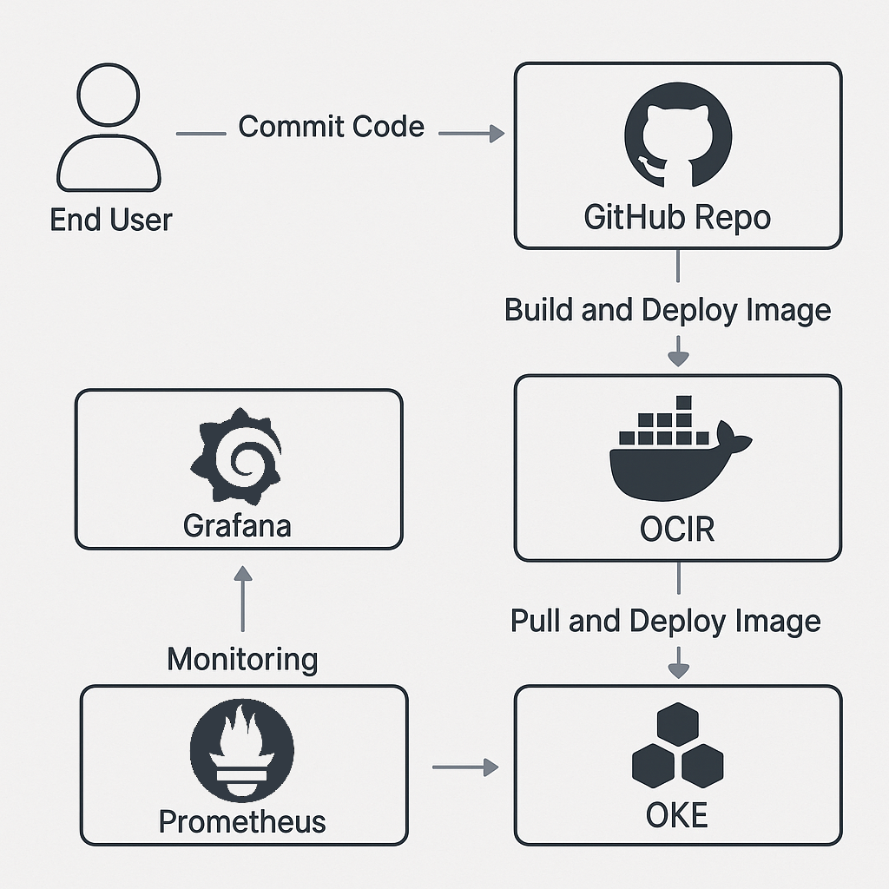

# ☁️ OCI DevOps Demo

An example project demonstrating an end-to-end DevOps pipeline in **Oracle Cloud Infrastructure (OCI)**:
- Infrastructure as Code (IaC) using **Terraform** (OKE, networking, monitoring)
- Continuous Integration / Continuous Deployment (CI/CD) with **GitHub Actions**
- Container-based application (**Python + Flask + Gunicorn**)
- Observability stack with **Prometheus + Grafana**
- Security scan workflow using tools for Terraform code analysis combined with **AI insights**

---

## 🏗️ Architecture



- **OKE** – managed Kubernetes cluster in OCI  
- **OCIR** – private container registry (Docker images)  
- **Prometheus & Grafana** – metrics collection and visualization  
- **GitHub Actions** – CI/CD pipeline automating build → push → deploy  

---

## 📁 Repository Structure

<pre>
oci-devops-demo/
├── app/                         # Python application code (Flask + Gunicorn)
│   ├── main.py
│   ├── requirements.txt
│   └── Dockerfile
│
├── k8s/                         # K8s manifests for the app
│   └── manifest.yaml
│
├── terraform/                   # OKE infrastructure + network + OCI policies
│   ├── oke.tf
│   ├── oke-network.tf
│   ├── oke-policies.tf
│   ├── oke-security-lists.tf
│   ├── variables.tf
│   ├── outputs.tf
│   ├── provider.tf
│   ├── backend.tf
│   └── data.tf
│
├── terraform-monitoring/        # Prometheus, Grafana (Helm)
│   ├── monitoring.tf
│   ├── backend.tf
│   ├── provider.tf
│   └── variables.tf
│
├── bootstrap/                   # Terraform backend and state storage initialization
│   ├── main.tf
│   ├── provider.tf
│   └── variables.tf
│
├── .github/workflows/           # CI/CD pipelines (GitHub Actions)
│   ├── ci-cd.yml                # build & deploy application
│   ├── bootstrap-tfstate.yml    # create Terraform backend
│   ├── deploy-terraform.yml     # infrastructure provisioning
│   ├── destroy-terraform.yml    # environment teardown
│   └── security.yml             # security analysis (Trivy, Checkov)
│
├── tools/                       # helper scripts
│   └── analyze_security.py
│
├── .gitignore
├── .trivyignore
├── checkov.yml
└── trivy.yaml
</pre>

---

## 🚀 CI/CD Pipeline (GitHub Actions)

Main workflow: `.github/workflows/ci-cd.yml`

Stages:
1. 🧱 Build & Push  
   - builds a Docker image from `app/` and pushes it to OCIR  
2. ☸️ Deploy  
   - retrieves kubeconfig from OKE  
   - updates secrets and deploys `k8s/manifest.yaml`  
3. ✅ Health check  
   - verifies Deployment and LoadBalancer status  

---

## 🐍 Application: demo-python-app

A simple Flask service (Gunicorn) exposing several endpoints:
- `/` – dashboard showing build metadata (Git SHA, build time, Pod info)
- `/metrics` – Prometheus metrics
- `/healthz` – liveness probe
- `/readyz` – readiness probe

Example of running locally:
```

cd app
pip install -r requirements.txt
python main.py

# application listens at [http://localhost:8080](http://localhost:8080)

```

---

## ☸️ Kubernetes (OKE)

### Deployment
- one Deployment + LoadBalancer Service in the namespace defined in `manifest.yaml`
- uses a ConfigMap to set theme color and message

### Monitoring (Prometheus + Grafana)
Managed by Terraform (`terraform-monitoring/monitoring.tf`).

- **Prometheus**: collects metrics from the application and cluster components  
- **Grafana**: available via LoadBalancer (`admin` / `${var.adminPassword}`)  

---

## ⚙️ Terraform provisioning

### Infrastructure stages
1. **bootstrap/** – Terraform backend and OCI Object Storage bucket for state  
2. **terraform/** – provisioning OKE, networking, policies, and keys  
3. **terraform-monitoring/** – Prometheus and Grafana via Helm  

Executed via the `deploy-terraform.yml` pipeline.

### Manual run example
```

cd terraform
terraform init
terraform apply

# then:

cd ../terraform-monitoring
terraform init
terraform apply

```

---

## 🧠 Security & Scans

The repository includes:
- **Checkov** – Terraform configuration analysis  
- **Trivy** – Docker image and repository scan  
- **AI analysis** – suggestions based on detected Terraform issues  

Workflow: `.github/workflows/security.yml`

---

## 🧰 Useful commands

```

# check cluster and Grafana status

kubectl -n monitoring get all

# local access to Prometheus (port-forward)

kubectl -n monitoring port-forward svc/kube-prometheus-stack-prometheus 9090:9090

# application logs

kubectl -n <namespace> logs deploy/demo-python-app

```

---

## 🔐 Variables & Secrets

GitHub Actions secrets stored in repository settings:
- OCI_USER_OCID, OCI_TENANCY_OCID, OCI_REGION, OCI_PRIVATE_KEY_PEM  
- OCIR_NAMESPACE, OCI_AUTH_TOKEN, DOCKER_USERNAME, OKE_CLUSTER_ID  
- K8S_NAMESPACE  

Terraform secrets:
- `var.adminPassword` – Grafana admin password  

---

## 👨‍💻 Author

Demo project created by **Domino08085**